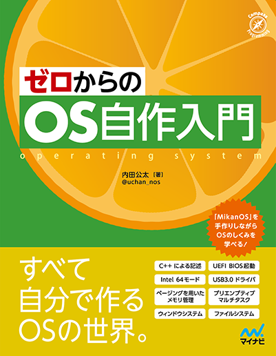

# ゼロからの OS 自作入門

このリポジトリは 2021 年 3 月に出版予定の書籍『ゼロからの OS 自作入門』のサポートを行う場所です。
書籍の内容に関する質疑応答、正誤表の提供、読者同士のコミュニケーションを主な目的としています。

[「はじめに」と「0章」のサンプル PDF ファイル](./book-sample.pdf)

## News

2021 年 3 月 27 日から、毎週土曜日夜に「MikanOS もくもく会」を開催します。uchan が Discord に待機しているので、質問したり、あるいはもくもくと読書をする時間です。

基本は毎週土曜日 21:00 - 22:00 の開催ですが、uchan の都合により中止したり曜日がずれたりします。

毎週 1 章ずつ進みます。初回 3/27 は第 1 章からです。その章とそれ以前の章について uchan に質問できます。それ以降の章に関する質問はしないでください。（早く進めたい人は自力で頑張ってください、ということです）

Discord 招待リンク→ [discord.gg/w227g2Q](https://discord.gg/w227g2Q)

## 質疑応答

書籍の内容に関する質疑応答は [Issues](https://github.com/uchan-nos/os-from-zero/issues) で受け付けます。
書籍を読んでの質問でもいいですし、書籍を読む前の質問も可能です。
質問の前に [FAQ](./faq.md) をチェックし、可能ならば Issues の過去の質疑応答も検索し、すでに回答があるかどうかを調べてください。

回答は著者だけとは限らず、他の読者の方がする可能性があります。
読者の皆さんは回答可能な質問を見つけたら、自由に回答していただいてかまいません。

## 議論の場

また、質疑応答に限らず、少し発展的な議論などにも [Issues](https://github.com/uchan-nos/os-from-zero/issues) を活用していただけます。
トピックごとに Issue を立て、議論を深めていってください。

深い議論を行いたい場合は [osdev-jp](https://osdev.jp/) の Slack やメーリングリストもご活用ください。

## 正誤情報

正誤情報は errata ディレクトリに随時追加していきます。
初版の正誤情報へのリンク： [第1刷](./errata/first_1suri.md) [第2刷](./errata/first_2suri.md) [第3刷](./errata/first_3suri.md)

## 参考文献 URL

最新の参考文献の URL を [ref-latest](./ref-latest.md) にて集約しています。
リンク切れを見つけた際は報告、またはプルリクエストをいただけると幸いです。
（リンク先は常に変動する可能性があるため、正誤としては扱いません）

## 読書記録、成果物の紹介

読書記録や成果物の紹介などは、ぜひ当リポジトリの [Wiki](https://github.com/uchan-nos/os-from-zero/wiki) に書いて欲しいなと思います。

Wiki というのは、読者の皆さんによって編集できる Web ページのことです。

皆さんが 1 つの Wiki に情報を集約してくださることにより、知見が読者間で共有しやすくなります。
もちろん個人のブログに記事を書くなどでも良いのですが、
その際は Wiki に個人ページを作ってリンクを張り、ブログ記事を紹介していただけると嬉しいです。

MikanOS を改造したり、独自の OS を作ったりしたら、ぜひ個人ページで自慢してください！

## よくある質問と回答

[FAQ](./faq.md) にまとまっています。

## 書籍情報

- タイトル：ゼロからの OS 自作入門
- 著者：内田公太（uchan）
- 出版社：マイナビ出版
- 出版日：2021 年 3 月 22 日
- ページ数：744
- ISBN：978-4-8399-7586-9
- [ゼロからのOS自作入門の目次](./toc.md)
- [マイナビ出版の書籍ページ](https://book.mynavi.jp/ec/products/detail/id=121220)
- [Amazonの商品ページ](https://amzn.to/2ZNwQtn)
- [サンプル PDF](./book-sample.pdf)
- [公式ハッシュタグ](https://twitter.com/hashtag/%E3%82%BC%E3%83%AD%E3%81%8B%E3%82%89%E3%81%AEOS%E8%87%AA%E4%BD%9C%E5%85%A5%E9%96%80)

## リンク集

- MikanOS ソースコード：[github.com/uchan-nos/mikanos](https://github.com/uchan-nos/mikanos)
- MikanOS 開発環境：[github.com/uchan-nos/mikanos-build](https://github.com/uchan-nos/mikanos-build)
- osdev-jp：[osdev.jp](https://osdev.jp/)
- 著者（uchan）のTwitter：[@uchan_nos](https://twitter.com/uchan_nos)

## osdev-jp

書籍の筆者 uchan が管理する「osdev-jp」というコミュニティがあります。
自作 OS やその関連技術が好きな人が集まるコミュニティになっておりますので、興味のある方はご加入ください。

osdev-jp では、定期的に「自作 OS もくもく会」を開催しています。よろしければご参加ください。
もくもく会の開催が決まると [connpass の osdev-jp ページ](https://osdev-jp.connpass.com/) で告知、募集が行われます。

## プレゼント企画

22 歳以下の未就業の方に本書を抽選でプレゼントいたします。

プレゼント企画は合計 3 回実施する予定です。各回の当選人数は 3 名を予定しています。
- 第1弾：締め切り 2021 年 3 月 21 日
- 第2弾：締め切り 2021 年 3 月 31 日
- 第3弾：締め切り 2021 年 4 月 21 日

第3弾の応募はこちらから： [「ゼロからのOS自作入門」プレゼント（第3弾）](https://docs.google.com/forms/d/e/1FAIpQLSdtn_43oqselsCWfd6quo39sUTblWAs6CMSIjdI96js2qU23A/viewform?usp=sf_link)
